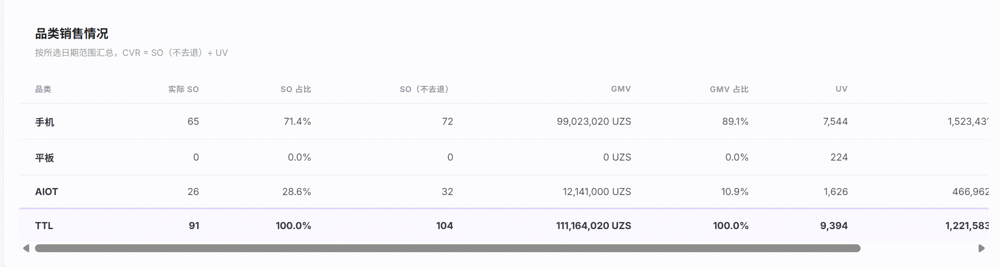
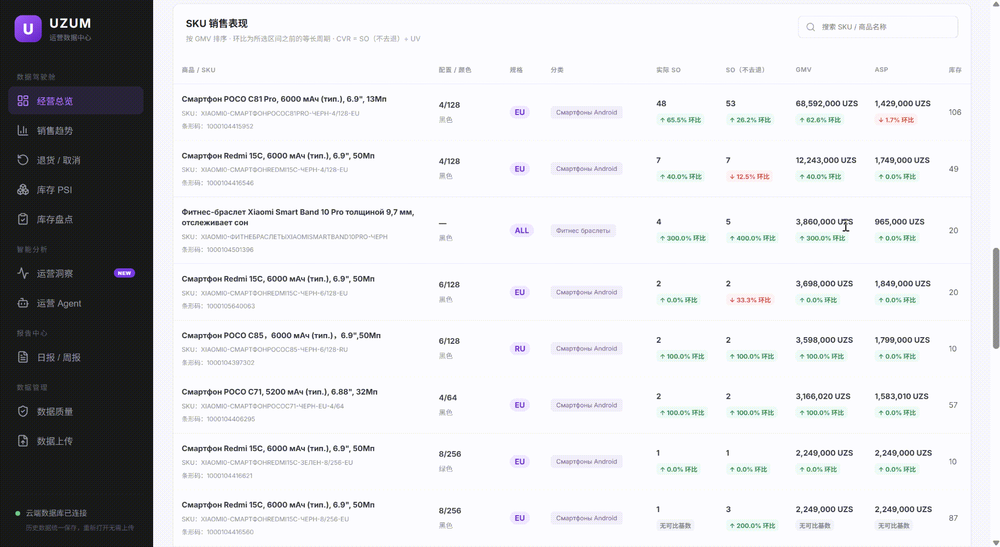
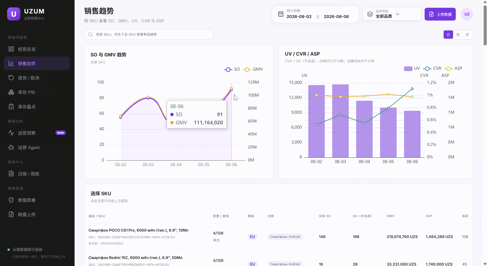
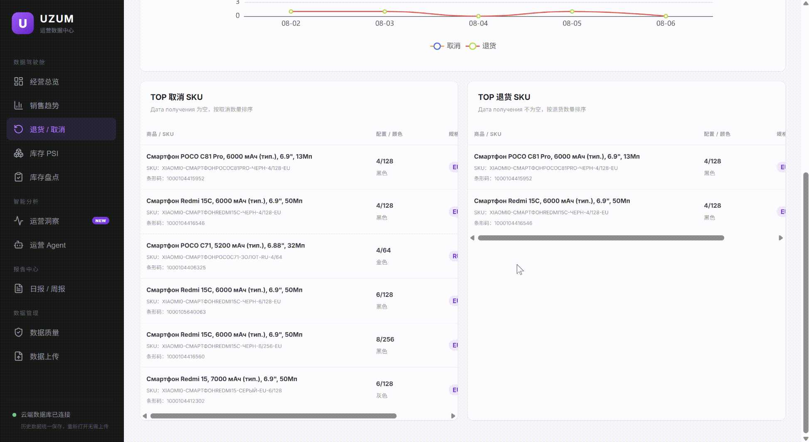
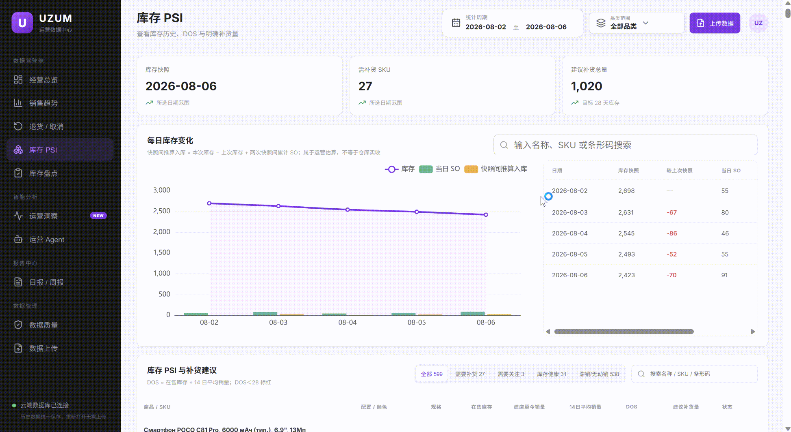
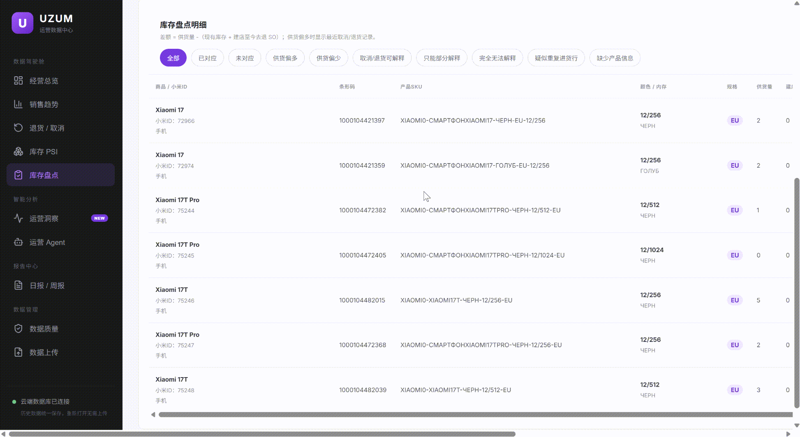
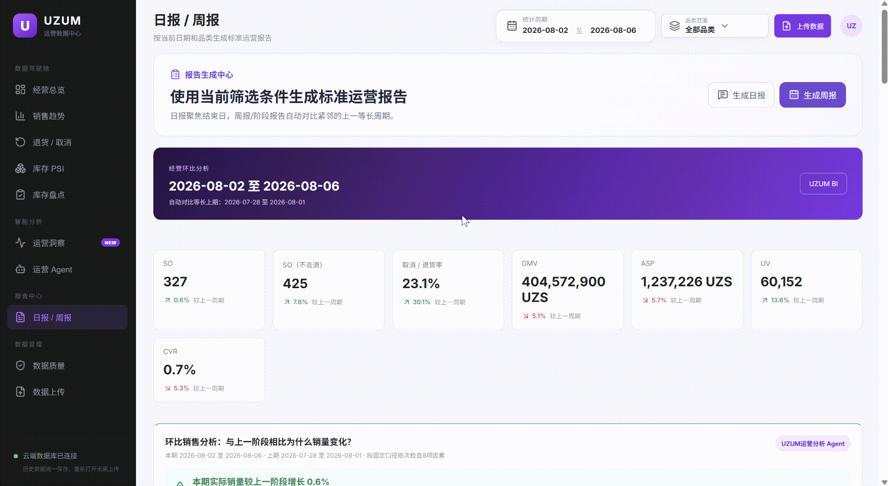

# UZUM 运营 BI：从手工报表到经营决策系统

> 求职作品集项目｜公开数据、截图和动图均为脱敏或虚构演示内容；原始生产代码与真实业务数据不公开。

## 项目一句话

这是一个面向电商运营的业务智能系统。我将销售、库存、流量、取消/退货和供货信息统一到同一套口径中，并围绕运营人员每天真正要回答的问题，搭建了经营看板、库存 PSI、库存盘点、数据质量检查、规则型运营 Agent 以及日报/周报。

项目重点不只是“展示图表”，而是缩短从原始数据到运营动作的路径。

## 项目背景

在原有工作流中，运营人员每天需要在多个 Excel 文件之间反复下载、清洗、VLOOKUP、计算和核对：

- 在规定时间内记录上一日 SO、GMV、ASP 等销售指标；
- 手动更新每个 SKU 的库存、14 日平均销量、DOS 和补货建议；
- 逐日保存库存与流量快照，才能回看趋势；
- 每周把供货、销量、库存、取消和退货重新汇总，完成进销存盘点与异常追踪。

这一流程通常需要 **4 小时以上**，但依然容易出现日期错位、字段不一致、重复累计、漏传文件或异常发现滞后的问题。

## 我解决了什么问题

| 原始痛点 | 产品化解决方式 |
|---|---|
| 多份底表分散、字段语言不一致 | 统一销售、库存、流量和商品映射字段，并按日期入库 |
| 每天手工更新报表 | 通过固定口径实时生成经营总览、趋势和 KPI |
| 库存与流量没有连续历史记录 | 保留每日快照，支持按日、周、月与等长周期对比 |
| 取消和退货混在一起 | 根据收货日期拆分取消与退货，分别追踪 TOP SKU |
| 盘点靠人工 VLOOKUP 与公式 | 通过供货量、商品映射、累计 SO 和最新库存自动核对 |
| AI 自动化结果难以信任 | 增加数据质量检查、上传历史和口径说明，所有结论可回溯 |

## 项目进行过程

### 1. 从运营任务而不是“现有报表”开始设计

我先拆解每日与每周的实际工作：日报、PSI、补货、销量归因、取消/退货、进销存盘点和周报复盘。根据不同问题的统计逻辑，最终将系统拆分为 8 个独立但相互关联的板块，避免所有指标堆在一个页面里造成使用混乱。

### 2. 对齐多源数据与业务口径

我梳理销售、库存、流量、供货与商品映射文件的字段关系，并明确关键口径：

- 实际 SO = 数量 − 取消/退货；SO（不去退）= 数量；
- ASP = GMV ÷ 实际 SO；CVR = 匹配口径下的 SO（不去退）÷ 详情页打开次数；
- 业务库存日 D 对应原始库存快照 DATE = D+1；
- 14 日均销固定按最近 14 个自然日计算，DOS 用于补货风险识别；
- 盘点差额 = 实际供货量 −（最新库存 + 建店至今实际 SO）。

### 3. 以真实业务数据反复校验，而不是只看页面是否能跑

搭建后，我先上传业务数据，将系统输出逐项与人工统计结果和原有表格核对；对于日期、库存、取消/退货、CVR 等容易发生偏差的部分，持续修正规则，直到结果与人工核算一致。公开版本只保留虚构或脱敏数据。

### 4. 把分析规则做成可复用的产品能力

在数据看板之外，我将日常高频问题固化为规则型 Agent：销量为什么变化、哪些 SKU 需补货、哪些商品无动销、哪些 SKU 的 CVR 下滑、当前周期相对上一周期发生了什么。每条结论附带比较范围、指标口径和数据完整性提示。

## 功能与截图展示

以下 GIF 使用 2026-08-02 至 2026-08-06 的虚构演示数据。

### 1. 经营总览：把“看数字”变成“先做什么”

按日展示 SO、GMV、ASP、UV、CVR、取消/退货、品类和 SKU 表现；每日经营诊断会先识别销量、流量、转化、库存与售后压力，再输出当天优先处理的运营动作。

### 2. SKU 销售表现：快速定位具体商品

支持按 SKU 或商品名称搜索，结合实际 SO、GMV、ASP、库存和周期环比定位重点商品；商品身份信息可由库存历史补齐，但库存数量只取指定快照，避免把最新库存误当作历史数据。

### 3. 销售趋势：同时看规模、流量、转化和客单价

支持自选日期、品类和日/周/月粒度，自动对比紧邻的等长上一周期。SO 与 GMV 用于看规模，UV、CVR、ASP 用于进一步判断变化更可能来自流量、转化、价格或产品结构。

### 4. 取消/退货：拆分售后问题并定位 TOP SKU

系统根据收货日期区分取消和退货，分别展示趋势与 TOP SKU。这样可以把“售后量上升”进一步变成具体的商品、价格、竞品、评价或履约问题线索。

### 5. 库存 PSI：用库存天数驱动补货与去库存

按 SKU 展示在售库存、建店至今销量、14 日均销、DOS 和建议补货量，并分类“需要补货 / 需要关注 / 库存健康 / 滞销无动销”。系统还会依据相邻快照与期间 SO 推算入库，用于和后台记录交叉核对。

### 6. 库存盘点：从“算差额”到“解释差额”

上传供货量与商品映射表后，系统自动调用既有销售和库存数据，输出进销存是否对应、供货偏多/偏少、缺少产品信息、疑似重复进货等结果。对于正差额，系统按最近取消/退货事件逐步解释，帮助业务人员确定优先核查 SKU。

### 7. 标准化日报/周报：降低重复输出成本

根据所选日期与品类一键生成日报或周报，自动比较等长上一周期，汇总 KPI、SKU/品类贡献、库存风险、热销与滞销榜单及经营解读；结果可复制为群消息，缩短人工整理时间。

## 项目中的卡点与解决方案

| 卡点 | 我的处理方式 |
|---|---|
| 平台无法按历史日期一次性下载库存和流量数据 | 设计日级快照留存逻辑，并将连续快照用于趋势分析与库存变化计算 |
| 取消与退货在源数据中混合 | 通过收货日期识别取消/退货，保留事件时间用于盘点差额解释 |
| 看板结果和人工表格可能不一致 | 使用真实业务数据逐条对账，优先修正日期、字段映射、库存边界与指标公式 |
| 盘点差额难以定位原因 | 接入供货量与小米 ID—条形码—SKU 映射；正差额按最近取消/退货事件进行解释 |
| 自动下载可能得到空表或不完整数据 | 建立数据质量模块与上传历史，检查空文件、缺失日期、行数异常、日期错位和漏传 |
| AI 开发对话记录意外丢失 | 根据现有功能反向重建规则，并沉淀数据口径、操作手册和接管清单，减少后续维护风险 |

## 项目复盘

### 我认为做对的部分

1. **从业务场景出发。** 先问“运营每天需要做什么决策”，再决定页面和指标，而不是先画图表。
2. **把数据质量放进产品。** 自动化不是减少人工判断，而是把人工从重复录表中释放出来，用于抽检和决策。
3. **让 Agent 的结论可验证。** 所有诊断都必须能回溯到比较周期、数据口径、SKU/品类贡献和数据完整性。
4. **将交接视为产品的一部分。** 对话丢失暴露出知识只存在于聊天记录中的风险，因此补齐了操作手册、公式速查和接管规则。

### 仍可继续迭代的部分

- 将部分规则型异常检测升级为统计异常检测与补货预测；
- 统一不同页面中 CVR 的日期 + SKU 匹配实现；
- 增加用户权限与更细粒度的数据访问控制；
- 为库存调拨、盘盈盘亏和取消/退货回流建立更完整的事件链路；
- 为 AI 自动下载增加更严格的下载成功判定与告警。

## 我的个人贡献

AI 辅助了代码实现，但项目的业务设计与验收并不是由 AI 自动完成。我负责：

- 识别原始工作流中的效率瓶颈，定义项目范围和优先级；
- 梳理销售、库存、流量、供货与商品映射字段；
- 定义 SO、GMV、ASP、CVR、DOS、补货和盘点差额等业务规则；
- 设计 8 个业务板块的信息架构、筛选逻辑与使用路径；
- 将实际运营痛点映射为 Agent 工作流与数据质量要求；
- 使用原始表格校验输出、发现边界情况并推动规则修正；
- 规划演示数据、隐私边界、项目文档与后续接管方式；
- 指导 AI 辅助开发、审阅生成结果并完成端到端测试。

## 技术与方法

- **前端：** React、TypeScript、Vite、ECharts
- **后端：** FastAPI、Python、SQLAlchemy、Pandas、OpenPyXL
- **数据库：** PostgreSQL（生产）与 SQLite（本地）
- **部署：** Docker
- **方法：** 数据清洗、指标体系设计、电商运营分析、库存 PSI、进销存核对、规则型 Agent、数据质量管理

## 数据安全

- 不公开真实订单、用户信息、内部链接、账号凭据、数据库连接或原始业务底表；
- 本仓库中的数值、日期、截图和动图均用于作品集演示；
- 生产代码与真实业务数据保持私有；
- 在添加任何素材前，按 [隐私检查清单](docs/privacy-checklist.md) 进行检查。

## 补充材料

- [完整的业务案例（English）](docs/business-case.md)
- [数据口径说明](docs/metric-definitions.md)
- [业务逻辑说明](docs/business-logic.md)
- [架构说明](docs/architecture.md)

